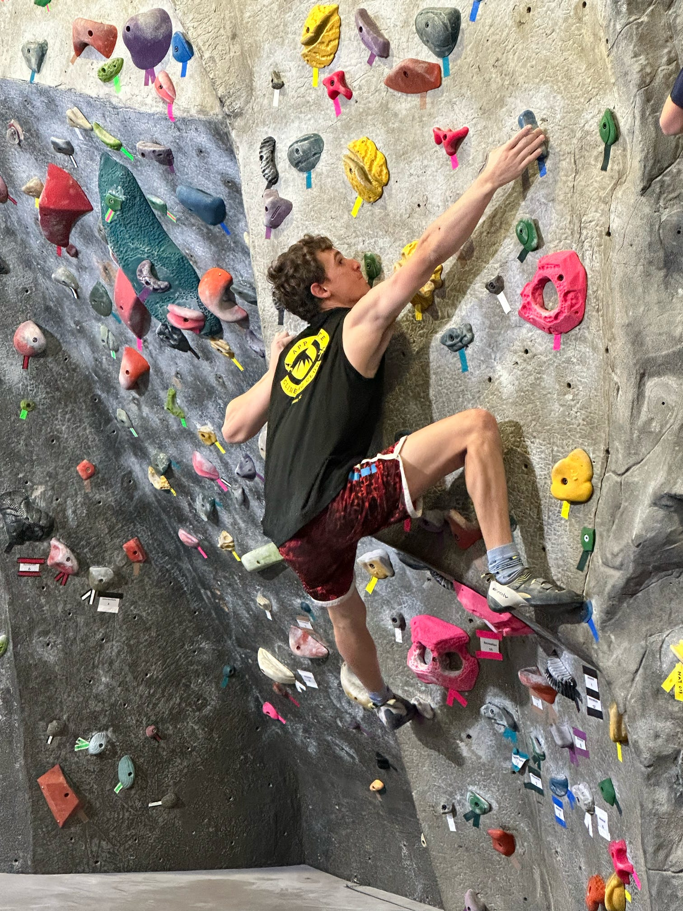

{width="400"} {width="250"}

{width="250"} {width="400"}

As a hockey player, rock climber, and lifelong sports fan, I am excited to combine my strong math skills with my passion for sports. As a current employee of the Durham Bulls Baseball Club and through my past internships with the App State baseball team and Prep Baseball Report, I am strengthening and expanding my skills in data collection and analysis through real world experience.
